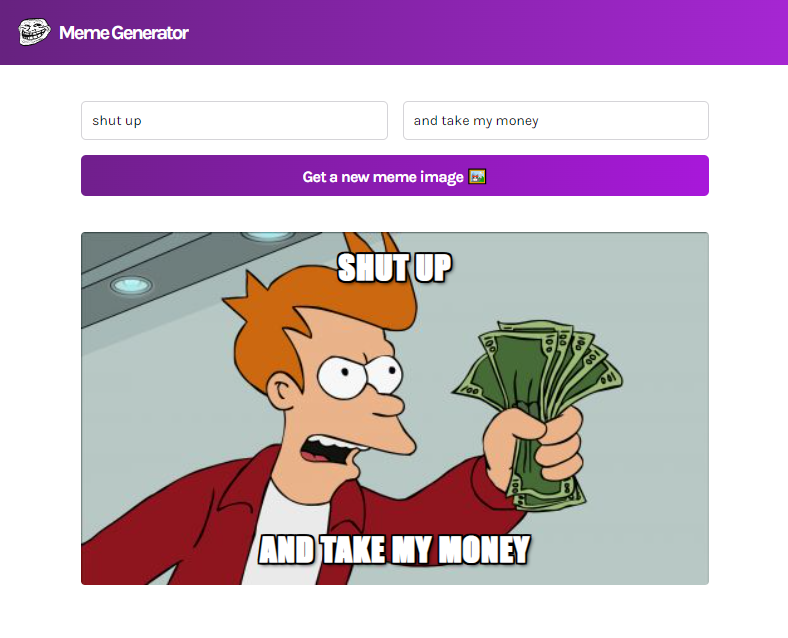

## Meme Generator

This is an API project completed during Bob Ziroll's _React basics_ course from [_The Frontend Developer Career Path_](https://scrimba.com/learn/frontend) on Scrimba.

Built with:

- React + Hooks
- CSS + Flexbox
- Imgflip API

## Live site:

[https://double-vee.github.io/react-meme-generator](https://double-vee.github.io/react-meme-generator)

